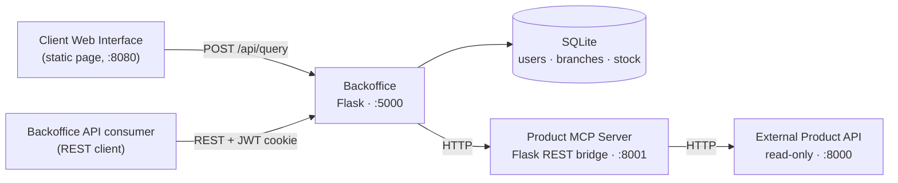

# HBntory

Inventory management system for a fictional multi-branch retail company.

HBntory is made of two user-facing pieces backed by three services. An
authenticated **Backoffice** lets staff manage users and per-branch stock. A
public **Client Web Interface** lets anonymous visitors ask questions about
products and availability. Product data itself is never stored locally — it is
always read on demand from an external, read-only **Product API** through a
dedicated **Product MCP Server**.

The local database only ever stores a product *identifier* alongside a quantity
and a branch. Names, descriptions, prices and supplier details all come from the
external API at request time.

---

## Table of contents

- [Architecture](#architecture)
- [Repository layout](#repository-layout)
- [Requirements](#requirements)
- [Quick start (Docker)](#quick-start-docker)
- [Running without Docker](#running-without-docker)
- [Configuration](#configuration)
- [Seed data and default accounts](#seed-data-and-default-accounts)
- [API reference](#api-reference)
- [Client Web Interface](#client-web-interface)
- [Testing](#testing)
- [Known limitations](#known-limitations)
- [Documentation](#documentation)
- [Team](#team)

---

## Architecture



| Service | Responsibility |
|---|---|
| **Backoffice** | Authentication, authorization, user management, per-branch stock, and the public query endpoint. Owns the only database. |
| **Product MCP Server** | Sole gateway to the external Product API. Exposes `list_products` and `get_product_details` as MCP tools, plus a thin REST wrapper over the same client logic. |
| **External Product API** | Read-only source of product data, provided as a Docker image. Never written to. |
| **Client Web Interface** | Static HTML/CSS/JS page. Sends a question, renders the answer. No authentication. |

Every service addresses the others by Compose **service name**, never
`localhost` — inside a container `localhost` refers to that container itself.

---

## Repository layout

```
Hbntory/
├── docker-compose.yml          # full stack, `stub` and `real` profiles
├── .env.example                # template for local .env (never commit .env)
├── backoffice/
│   ├── Dockerfile
│   ├── requirements.txt
│   ├── run.py                  # entrypoint, creates tables on boot
│   ├── seed.py                 # idempotent: admin, branches, users, sample stock
│   └── app/
│       ├── __init__.py         # create_app(), blueprint registration
│       ├── config.py
│       ├── extensions.py       # db = SQLAlchemy()
│       ├── models.py           # User, Branch, Stock
│       ├── auth/               # login, JWT cookie, route guards
│       ├── admin/              # user management (admin only)
│       ├── stock/              # add / remove / consult (common users only)
│       ├── products/           # mcp_client.py — talks to the MCP server
│       └── public/             # unauthenticated /api/query endpoint
├── product_mcp_server/
│   ├── Dockerfile
│   ├── server.py               # FastMCP tools
│   ├── rest_api.py             # REST wrapper used by the Backoffice
│   └── product_api_client.py   # talks to the external Product API
├── product_api_tests/          # local stand-in for the Product API (dev only)
├── client_web/                 # index.html, app.js, styles.css
└── docs/
    ├── architecture.md
    ├── decisions.md
    ├── mvp.md
    └── diagrams/
```

---

## Requirements

- Docker and Docker Compose — the only requirement for the quick start.
- Python 3.12 if you intend to run services directly on your machine.

---

## Quick start (Docker)

The stack ships with two Compose profiles. Pick one depending on whether you
have the provided Product API image.

**Without the provided image** — uses the local stand-in in
`product_api_tests/`:

```bash
docker compose --profile stub up --build
```

**With the provided image** — set `PRODUCT_API_IMAGE` first:

```bash
cp .env.example .env
# edit .env and fill in PRODUCT_API_IMAGE
docker compose --profile real up --build
```

Both profiles publish the Product API under the network alias `product-api`, so
no other configuration changes between them.

Then initialise the database. This is needed on the **first run only** — the
SQLite file lives in a named volume and survives rebuilds:

```bash
docker compose exec backoffice python seed.py
```

The script is idempotent; running it again is harmless.

| Service | URL |
|---|---|
| Client Web Interface | <http://localhost:8080> |
| Backoffice interface and API | <http://localhost:5000> |
| Product MCP REST bridge | <http://localhost:8001> |
| Product API | <http://localhost:8000> |

Shut down with `docker compose --profile stub down`. Add `-v` to also drop the
database volume.

---

## Running without Docker

Useful when working on a single service. Each command runs from its own
directory, in its own terminal.

```bash
python -m venv venv && source venv/bin/activate
```

**Product API stand-in** (skip if you are running the provided image):

```bash
cd product_api_tests
pip install -r requirements.txt
python app.py                       # :8000
```

**Product MCP Server** (REST bridge):

```bash
cd product_mcp_server
pip install -r requirements.txt
PRODUCT_API_BASE_URL=http://localhost:8000 python rest_api.py    # :8001
```

**Backoffice**:

```bash
cd backoffice
pip install -r requirements.txt
python seed.py                      # first run only
PRODUCT_MCP_URL=http://localhost:8001 python run.py              # :5000
```

**Client Web Interface**:

```bash
cd client_web
python -m http.server 8080
```

The MCP tools in `server.py` are started by an MCP client over stdio rather
than run as a long-lived service:

```bash
cd product_mcp_server && python server.py
```

---

## Configuration

All configuration is environment-driven. Copy `.env.example` to `.env` and edit
it; `.env` is gitignored and must never be committed.

| Variable | Used by | Default | Purpose |
|---|---|---|---|
| `PRODUCT_API_IMAGE` | Compose | — | Image name for the provided Product API. Required for `--profile real`. |
| `SECRET_KEY` | Backoffice | `dev-only-change-me` | Signs the JWT session cookie. |
| `DATABASE_URL` | Backoffice | `sqlite:///hbntory.db` | SQLAlchemy connection string. |
| `PRODUCT_MCP_URL` | Backoffice | `http://localhost:8001` | Where to reach the MCP REST bridge. Compose sets it to the service name. |
| `PRODUCT_API_BASE_URL` | MCP Server | `http://localhost:5001` | Where to reach the external Product API. Compose sets it to `http://product-api:8000`. |

---

## Seed data and default accounts

`seed.py` creates one admin, two branches, two common users and four sample
stock rows. Passwords are stored as scrypt hashes — no plaintext ever reaches
the database.

| Email | Password | Role | Branch |
|---|---|---|---|
| `admin@company.com` | `Hbnt0ry!Adm1n` | Admin | — |
| `employe.thonon@company.com` | `Th0non!Stock9` | Common user | Branch Thonon |
| `employe.geneve@company.com` | `Geneve!Stock7` | Common user | Branch Geneve |

> These are development credentials committed on purpose so the project can be
> run and graded. Change them before this system is exposed anywhere real.

---

## API reference

Authentication uses a JWT stored in an `httponly` cookie named `access_token`.
The token carries only `{user_id, exp}` — permissions are re-read from the
database on every request, so deactivating a user takes effect immediately.

### Authentication

| Method | Path | Auth | Description |
|---|---|---|---|
| `POST` | `/auth/login` | — | Body `{email, password}`. Sets the session cookie. |
| `POST` | `/auth/logout` | — | Clears the session cookie. |
| `GET` | `/auth/me` | any active user | Current user: `email`, `is_admin`, `branch_id`, `branch_name`. |

```bash
curl -c cookies.txt -X POST http://localhost:5000/auth/login \
  -H 'Content-Type: application/json' \
  -d '{"email":"admin@company.com","password":"Hbnt0ry!Adm1n"}'
```

### User management — admin only

Common users receive `403` on all of these.

| Method | Path | Description |
|---|---|---|
| `GET` | `/admin/branches` | List branches, so a user can be assigned to one by name. |
| `GET` | `/admin/users` | List all users, active and deactivated. |
| `POST` | `/admin/users` | Create a common user. Body `{email, password, branch_id}`. |
| `PATCH` | `/admin/users/<user_id>` | Change `branch_id` and/or `password`. |
| `DELETE` | `/admin/users/<user_id>` | Soft delete — sets `is_active=false` and `deleted_at`. |

Passwords must be at least 8 characters and contain an uppercase letter, a
lowercase letter, a digit and a symbol. `branch_id` must reference an existing
branch.

```bash
curl -b cookies.txt -X POST http://localhost:5000/admin/users \
  -H 'Content-Type: application/json' \
  -d '{"email":"new@company.com","password":"Str0ng!Pass1","branch_id":"<branch-uuid>"}'
```

### Stock — common users only

The admin receives `403` on all of these. The branch is always taken from the
authenticated session, never from the request body, so a user cannot read or
modify another branch's stock even by crafting the request by hand.

| Method | Path | Description |
|---|---|---|
| `GET` | `/stock` | List every stock line for the caller's branch. |
| `GET` | `/stock/<product_id>` | Quantity of one product in the caller's branch. |
| `POST` | `/stock/add` | Body `{product_id, quantity}`. Creates the line if absent. |
| `POST` | `/stock/remove` | Body `{product_id, quantity}`. Refuses to go negative. |

`quantity` must be a positive integer. Booleans are rejected. Stock can never
go below zero — enforced both in the route and by a database constraint.

```bash
curl -b cookies.txt -X POST http://localhost:5000/stock/add \
  -H 'Content-Type: application/json' \
  -d '{"product_id":"HB-LAP-1001","quantity":10}'
```

### Public query — no authentication

| Method | Path | Description |
|---|---|---|
| `POST` | `/api/query` | Body `{question}`, max 500 characters. Returns `{answer}`. |

Returns `503` when the product catalog cannot be reached.

### Product MCP Server

| Method | Path | Description |
|---|---|---|
| `GET` | `/products` | Full catalog. `?include_discontinued=true` to include retired products. |
| `GET` | `/products/<sku>` | One product's details. `404` if unknown. |

Both are also exposed as MCP tools — `list_products` and
`get_product_details` — in `product_mcp_server/server.py`.

---

## Backoffice interface

A lightweight HTML/CSS/JS interface at <http://localhost:5000>, served by Flask
itself. Because it shares the API's origin, the session cookie travels with every
request and no CORS configuration is involved.

One page with three views, selected by role:

| View | Who sees it | What it does |
|---|---|---|
| Sign in | anonymous | Email and password, then routes to the right view. |
| Stock | common users | Lists the branch's stock, adds and removes quantities. |
| Users | admin | Lists users with their branch and status, creates users, deactivates them. |

The header always shows who is signed in and the **name of the branch** they are
operating on, so the scope of any stock change is unambiguous.

Choosing the view by role is a convenience only. Authorization is enforced by the
backend route decorators, so hiding a control is never what keeps a user out of an
endpoint — a common user who calls an admin route directly still receives `403`.

Expired or missing sessions are detected centrally: any `401` returns the user to
the sign-in view.

## Client Web Interface

A single static page at <http://localhost:8080>. It posts to the Backoffice's
`/api/query` endpoint and renders the answer, with a loading state and error
handling for both network and server failures.

Four question types are supported:

| Intent | Example |
|---|---|
| Product details | `Give me details about HB-LAP-1001` |
| Availability | `Which branch has stock of HB-LGT-1801?` |
| Branch inventory | `What products can I find in Branch Thonon?` |
| Multi-item shopping list | `I want to buy 3 units of HB-LAP-1001 and 2 units of HB-MON-2101` |

Questions that cannot be understood return a help message listing these
examples. The engine never invents an answer: unknown product identifiers are
reported as unknown.

---

## Testing

Bring up the stack and seed it, then run the checks below. Each line states the
expected HTTP status. Every command listed here has been executed against the
running stack and produces the documented result.

```bash
docker compose --profile stub up --build -d
docker compose exec backoffice python seed.py
B=http://localhost:5000
```

**Authentication and authorization**

```bash
# admin logs in                                              -> 200
curl -s -c admin.txt -X POST $B/auth/login -H 'Content-Type: application/json' \
  -d '{"email":"admin@company.com","password":"Hbnt0ry!Adm1n"}' -w '%{http_code}\n' -o /dev/null

# wrong password                                             -> 401
curl -s -X POST $B/auth/login -H 'Content-Type: application/json' \
  -d '{"email":"admin@company.com","password":"wrong"}' -w '%{http_code}\n' -o /dev/null

# no cookie on a protected route                             -> 401
curl -s $B/admin/users -w '%{http_code}\n' -o /dev/null

# common user logs in                                        -> 200
curl -s -c emp.txt -X POST $B/auth/login -H 'Content-Type: application/json' \
  -d '{"email":"employe.thonon@company.com","password":"Th0non!Stock9"}' -w '%{http_code}\n' -o /dev/null

# common user reaching an admin route                        -> 403
curl -s -b emp.txt $B/admin/users -w '%{http_code}\n' -o /dev/null

# admin reaching a stock route                               -> 403
curl -s -b admin.txt $B/stock -w '%{http_code}\n' -o /dev/null

# session invalid after logout                               -> 200 then 401
curl -s -b emp.txt -c emp.txt -X POST $B/auth/logout -o /dev/null -w '%{http_code} '
curl -s -b emp.txt $B/stock -w '%{http_code}\n' -o /dev/null
```

**Stock operations and branch isolation**

```bash
# add stock to own branch                                    -> 200
curl -s -b emp.txt -X POST $B/stock/add -H 'Content-Type: application/json' \
  -d '{"product_id":"HB-LAP-1001","quantity":10}' -w '%{http_code}\n' -o /dev/null

# remove more than available                                 -> 400
curl -s -b emp.txt -X POST $B/stock/remove -H 'Content-Type: application/json' \
  -d '{"product_id":"HB-LAP-1001","quantity":9999}' -w '%{http_code}\n' -o /dev/null

# negative quantity rejected                                 -> 400
curl -s -b emp.txt -X POST $B/stock/add -H 'Content-Type: application/json' \
  -d '{"product_id":"HB-LAP-1001","quantity":-5}' -w '%{http_code}\n' -o /dev/null

# product held only by another branch                        -> 404
curl -s -b emp.txt $B/stock/prod-003 -w '%{http_code}\n' -o /dev/null
```

**User management**

```bash
# weak password rejected                                     -> 400
curl -s -b admin.txt -X POST $B/admin/users -H 'Content-Type: application/json' \
  -d '{"email":"weak@company.com","password":"abc","branch_id":"<uuid>"}' -w '%{http_code}\n' -o /dev/null

# non-existent branch rejected                               -> 400
curl -s -b admin.txt -X POST $B/admin/users -H 'Content-Type: application/json' \
  -d '{"email":"ghost@company.com","password":"Str0ng!Pass1","branch_id":"nope"}' -w '%{http_code}\n' -o /dev/null

# duplicate email rejected                                   -> 409
# soft-deleted user can no longer log in                     -> 401
```

**Product MCP Server — REST bridge**

```bash
curl -s http://localhost:8001/products                    # -> 200, full catalog
curl -s http://localhost:8001/products/HB-LAP-1001        # -> 200, details
curl -s http://localhost:8001/products/NOPE-9999          # -> 404
```

**Product MCP Server — MCP tools**

The REST checks above exercise `product_api_client.py` through the REST wrapper.
The MCP tool layer is a separate surface and is tested on its own, from
`product_mcp_server/` with the Product API reachable on `:8000`.

Tool definitions, as an MCP client sees them — no Product API needed:

```bash
fastmcp list server.py
# -> Tools (2)
#      list_products(include_discontinued: bool = False) -> dict
#      get_product_details(sku: str) -> dict
```

Calling the tools. `PRODUCT_API_BASE_URL` is read at import time, and the
`fastmcp call` CLI does not propagate it to the server process, so the tools are
called through an in-memory client instead:

```bash
PRODUCT_API_BASE_URL=http://localhost:8000 python - <<'PY'
import asyncio
from fastmcp import Client
from server import mcp

async def main():
    async with Client(mcp) as c:
        r = await c.call_tool("list_products", {})
        print("list_products         ->", r.data["success"], r.data["count"])
        r = await c.call_tool("list_products", {"include_discontinued": True})
        print("  with discontinued   ->", r.data["count"])
        r = await c.call_tool("get_product_details", {"sku": "HB-LAP-1001"})
        print("get_product_details   ->", r.data["product"]["name"])
        r = await c.call_tool("get_product_details", {"sku": "NOPE-9999"})
        print("unknown sku           ->", r.data)

asyncio.run(main())
PY
```

Expected output:

```
list_products         -> True 3
  with discontinued   -> 4
get_product_details   -> Business Laptop 14
unknown sku           -> {'success': False, 'code': 'not_found',
                          'error': 'No product found with SKU NOPE-9999'}
```

Connection failure — rerun the same block with `PRODUCT_API_BASE_URL` pointing at
a port with nothing on it. Both tools return
`{'success': False, 'error': 'The Product API is not responding.'}` rather than
raising, so an MCP client always receives a usable result:

```bash
PRODUCT_API_BASE_URL=http://localhost:9 python - <<'PY'
... same script as above ...
PY
```

**Degraded behaviour**

```bash
docker compose stop product_mcp_server
curl -s -X POST $B/api/query -H 'Content-Type: application/json' \
  -d '{"question":"details about HB-LAP-1001"}'           # -> 503, clear message
docker compose start product_mcp_server
```

**Backoffice interface** — open <http://localhost:5000> and check that:

- signing in as the admin shows the Users view, with branches listed by name;
- signing in as a common user shows the Stock view, with the branch name in the
  header;
- adding and removing stock updates the table, and removing more than available
  shows the error returned by the API;
- creating a user with a weak password or a duplicate email shows the error;
- deactivating a user moves them to `Deactivated` and they can no longer sign in;
- logging out returns to the sign-in view.

**Client Web Interface** — open <http://localhost:8080> and click each of the
four example buttons. Each returns a coherent answer built from live catalog
data and local stock. An unrecognised question returns the help message.

---

## Known limitations

These are deliberate design choices with documented reasoning. See
[`docs/decisions.md`](docs/decisions.md) for the full record.

- **The AI Query Service is descoped for this phase**, as confirmed with the
  professor. `/api/query` is answered by a keyword-matching engine in
  `app/public/query_engine.py` rather than by an LLM agent. It answers the four
  documented question types and returns a help message otherwise — it never
  fabricates an answer.
- **The Backoffice reaches the MCP server over its REST wrapper**, not over MCP
  transport. A synchronous Flask caller speaking MCP directly was judged more
  friction than value at this stage. The MCP tools themselves remain
  implemented and are the canonical interface.
- **Stock is keyed by product identifier without a catalog lookup.** Adding
  stock does not verify the identifier against the external Product API, which
  keeps stock operations independent of that service's availability.
- **A JWT stays valid until it expires.** There is no token blacklist; the
  impact is bounded by keeping permissions out of the token and re-reading
  `is_admin` / `is_active` from the database on every request.
- **Cookies are set with `secure=False`** and there is no TLS. Acceptable for
  local development only; SSL is out of scope for this project.

---

## Documentation

| Document | Contents |
|---|---|
| [`docs/architecture.md`](docs/architecture.md) | Services, responsibilities, data flow, local vs external data |
| [`docs/decisions.md`](docs/decisions.md) | Communication strategy decisions with benefits and trade-offs |
| [`docs/mvp.md`](docs/mvp.md) | MVP scope: what ships first, what is deferred |
| [`docs/diagrams/`](docs/diagrams/) | Service and entity diagrams |

---

## Team

| Name | Area |
|---|---|
| Philippe Ghanem | Authentication, authorization, user management, containers and deployment |
| Jeremie Rouxel | Product MCP Server, Product API integration, Client Web Interface |
| Ilyan Camelin | Database models, seed data, stock operations |
