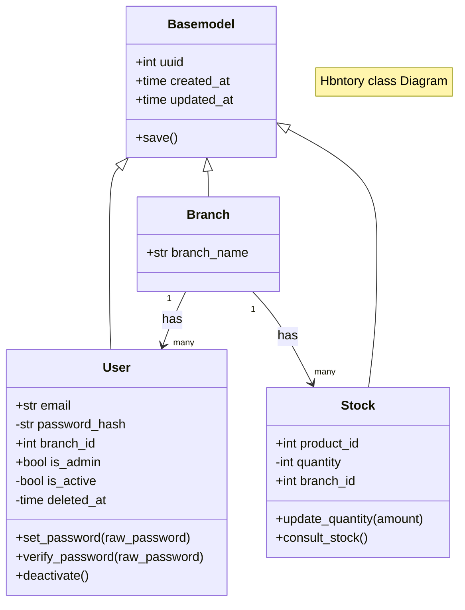
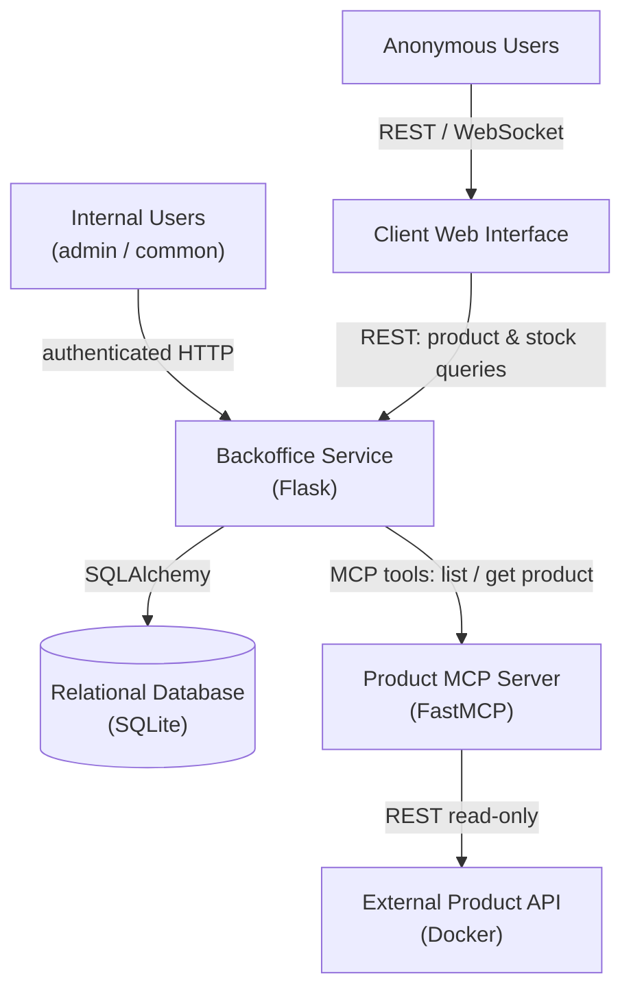

# Diagrams

## Class Diagram (data model)

```mermaid
classDiagram
    note "Hbntory class Diagram"

    class Basemodel {
        +int uuid
        +time created_at
        +time updated_at
        +save()
    }

    class User {
        +str email
        -str password_hash
        +int branch_id
        +bool is_admin
        -bool is_active
        -time deleted_at
        +set_password(raw_password)
        +verify_password(raw_password)
        +deactivate()
    }

    class Branch {
        +str branch_name
    }

    class Stock {
        +int product_id
        -int quantity
        +int branch_id
        +update_quantity(amount)
        +consult_stock()
    }

    Basemodel <|-- User
    Basemodel <|-- Branch
    Basemodel <|-- Stock

    Branch "1" --> "many" User : has
    Branch "1" --> "many" Stock : has
```

## Service Diagram (system architecture)

```mermaid
flowchart TD
    Internal["Internal Users<br/>(admin / common)"]
    Public["Anonymous Users"]

    Internal -->|authenticated HTTP| BO["Backoffice Service<br/>(Flask)"]
    Public -->|REST / WebSocket| CW["Client Web Interface"]

    CW -->|REST: product & stock queries| BO
    BO -->|SQLAlchemy| DB[("Relational Database<br/>(SQLite)")]
    BO -->|MCP tools: list / get product| MCP["Product MCP Server<br/>(FastMCP)"]
    MCP -->|REST read-only| API["External Product API<br/>(Docker)"]
```
