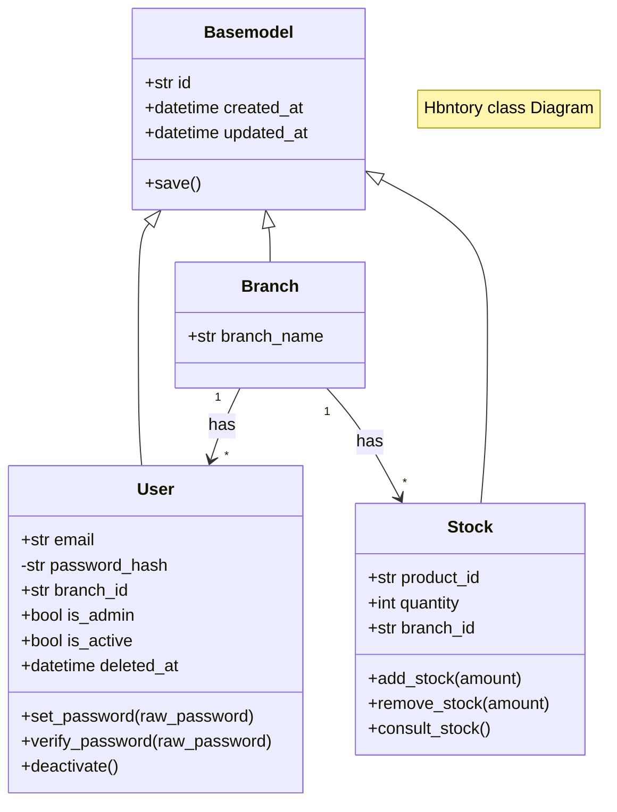
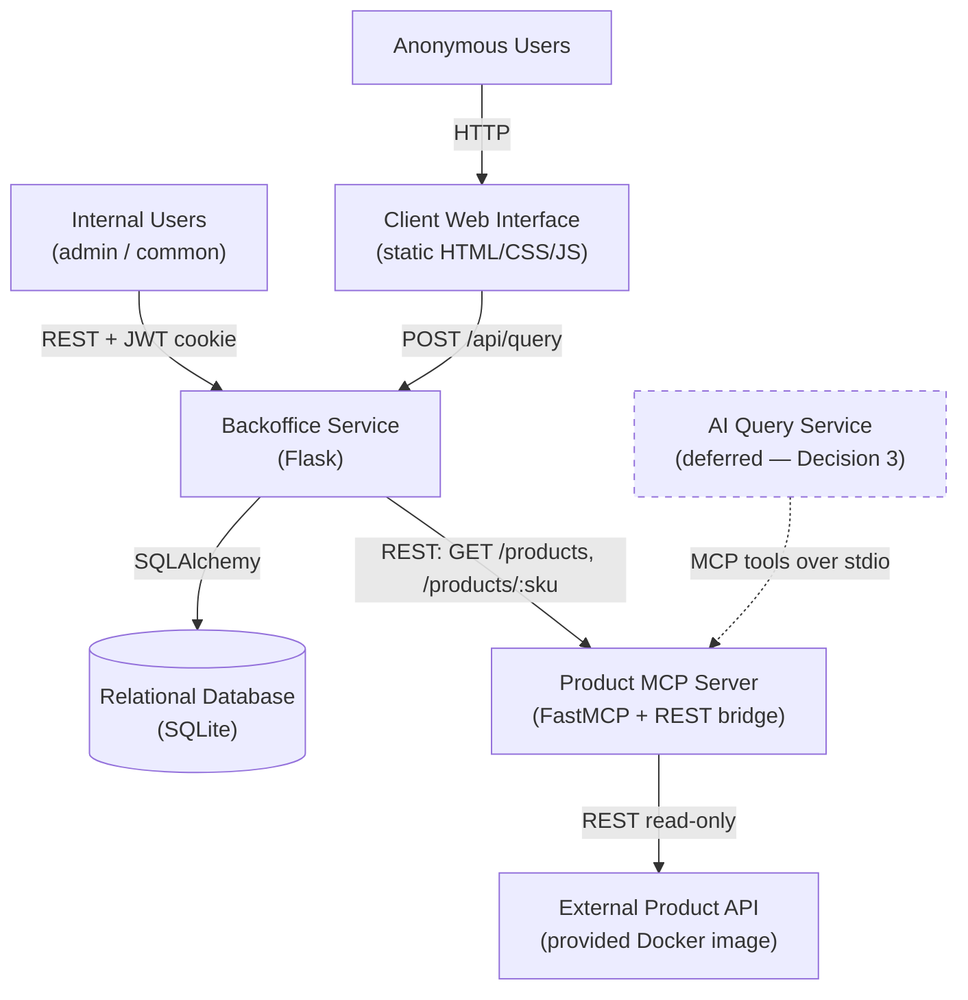
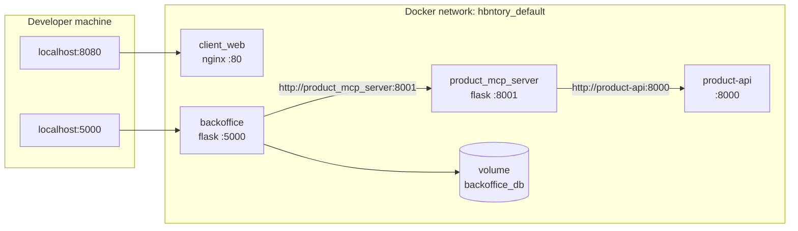

# Diagrams

Class, service and deployment views of HBntory. See
[`../architecture.md`](../architecture.md) for the written architecture and
[`../decisions.md`](../decisions.md) for the reasoning behind each choice.

## Class Diagram (data model)

**Constraints enforced at the database level:**

- `Stock.quantity >= 0` — a check constraint, so stock cannot go negative even if a
  route is bypassed.
- `UNIQUE (branch_id, product_id)` on `Stock` — one stock line per product per branch.
- `UNIQUE (email)` on `User`.

`Stock` holds only `product_id`; no product name, description or price is ever
persisted. `Branch` is a plain entity, not a join table — `User` and `Stock` each
carry `branch_id`, so there is no direct `Stock` ↔ `User` relationship.
`User.branch_id` is nullable at the schema level solely because the admin belongs
to no branch; common users always have one, enforced in the admin create and edit
flows.

## Service Diagram (system architecture)

The Backoffice reaches the MCP server over its REST wrapper rather than MCP
transport (Decision 3b). The MCP tools remain the canonical interface and are the
path a future AI Query Service would take — shown dashed because it is deferred
for this phase.

## Deployment Diagram (Docker Compose)

Services address each other by Compose **service name**. The `product-api` node is
either the provided image (`--profile real`) or the local stand-in
(`--profile stub`); both are published under the same network alias, so no other
service changes between profiles.
